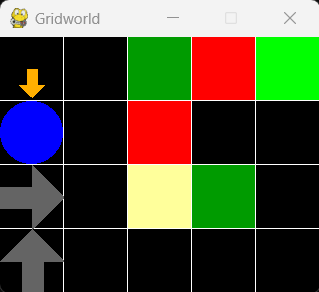
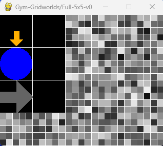

## Overview

Generic implementation of a gridworld environment for reinforcement learning based on [gymnasium](https://github.com/Farama-Foundation/Gymnasium).  
The default class `Gridworld` implements a "go-to goal" task where the agent has five actions (left, right, up, down, stay) and default transition function (e.g., doing "stay" in goal states ends the episode).  
You can change actions and transition function by implementing more classes. For example, in `RiverSwim` there are only two actions and no terminal state.  


## Install and Examples

To install the environments run
```
pip install -e .
```

Run `python` and then
```python
import gymnasium
env = gymnasium.make("Gym-Gridworlds/Penalty-3x3-v0", render_mode="human")
env.reset()
env.step(1) # DOWN
env.step(4) # STAY
env.render()
```

to render the `Penalty-3x3-v0` gridworld (left figure), and
```python
import gymnasium
env = gymnasium.make("Gym-Gridworlds/Full-5x5-v0", render_mode="human")
env.reset()
env.step(1) # DOWN
env.render()
```

to render the `Full-5x5-v0` gridworld (right figure).

<p align="center">
   &nbsp;&nbsp;&nbsp;&nbsp;&nbsp;
  
</p>

- Black tiles are empty,
- White tiles are walls (the agent cannot step on them),
- Black tiles with gray arrows are tiles where the agent can move only in one direction (other actions will fail),
- Red tiles give negative rewards,
- Green tiles give positive rewards (the brighter, the higher),
- Yellow tiles are quicksands, where all actions will fail with 90% probability,
- The agent is the blue circle,
- The orange arrow denotes the agent's last action,
- The orange dot denotes that the agent did not try to move with its last action.

It is also possible to add noise to the transition and the reward functions.
For example, in the following environment
```python
import gymnasium
env = gymnasium.make("Gym-Gridworlds/Full-5x5-v0", random_action_prob=0.1, reward_noise_std=0.05)
```
the agent's action will fail with 10% probability and a random one will be performed instead,
and Gaussian noise with 0.05 standard deviation is added to the reward.

You can also turn the MDP into a POMDP and learn from partially-observable pixels
by passing the `view_radius` argument. This way, only the tiles close to the agent
will be visible while far away tiles will be masked by white noise. For example,
this is the partially-observable version of the `Full-5x5-v0` gridworld above.

```python
import gymnasium
env = gymnasium.make("Gym-Gridworlds/Full-5x5-v0", render_mode="human", view_radius=1)
env.reset()
env.step(1) # DOWN
env.render()
```

<p align="center">
  
</p>


## Default MDP (`Gridworld` Class)

#### Action Space
The action is discrete in the range `{0, 4}` for `{LEFT, DOWN, RIGHT, UP, STAY}`.

#### Observation Space
The observation is discrete in the range `{0, size - 1}`.
Each integer denotes the current location of the agent.
For example, in a 3x3 grid the states are

```
 0 1 2
 3 4 5
 6 7 8
```

To use pixel observations, make the environment with the `render_mode=rgb_array` argument.  
To have partially-observable pixels, pass `view_radius=1` (or any positive integer).


#### Starting State
The episode starts with the agent at the top-left tile. Make new classes for
different starting states. For example, in `GridworldMiddleStart` the agent starts
in the middle of the grid, while in `GridworldRandomStart` it starts in a random tile.

#### Transition
Walls cannot be stepped on.  
By default, the transition is deterministic. It can be made stochastic by
passing `random_action_prob`. This is the probability that the action will
be random. For example, if `random_action_prob=0.1` there is a 10% chance
that the agent will do a random action instead of doing the one passed to
`self.step(action)`.  
If the agent is in a "quicksand" tile, any action will fail with 90% probability.

#### Rewards
- Doing `STAY` at the goal: +1
- Doing `STAY` at a distracting goal: 0.1
- Any action in penalty tiles: -10
- Any action in small penalty tiles: -0.1
- Otherwise: 0

White noise can be added to all rewards by passing `reward_noise_std`.
White noise can be added to all NONZERO rewards by passing `nonzero_reward_noise_std`.

#### Episode End
By default, an episode ends if any of the following happens:
- A positive reward is collected (termination),
- The length of the episode is `max_episode_steps` (truncation).
