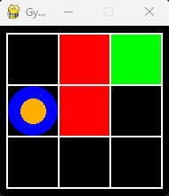

Generic implementation of gridworld for reinforcement learning based on [gymnasium](https://github.com/Farama-Foundation/Gymnasium).  
The class `Gridworld` describes a generic gridworld with five actions (left, right, up, down, stay) and some default rewards (small/large positive and negative rewards).  
You can define your own gridworld by defining its map. See `gym_gridworlds/gridworld.py` for more details.  
There are already some pre-implemented gridworlds. See `gym_gridworlds/gym.py` for more details.  


## Install and Examples

To install and use our environments, run
```
pip install -e .
```

Run `python` and then
```python
import gymnasium
env = gymnasium.make("Gym-Grid/Gridworld-Penalty-3x3-v0", render_mode="human")
env.reset()
env.step(1) # DOWN
env.step(4) # STAY
env.render()
```

to render the `Gridworld-Penalty-3x3-v0` (left figure), and
```python
import gymnasium
env = gymnasium.make("Gym-Grid/Gridworld-Full-5x5-v0", render_mode="human")
env.reset()
env.step(1) # DOWN
env.render()
```

to render the `Gridworld-Full-5x5-v0` (right figure).

<p align="center">
   &nbsp;&nbsp;&nbsp;&nbsp;&nbsp;
  
</p>

- Black tiles are empty,
- Black tiles with gray arrows are tiles where the agent can move only in one direction (other actions will fail),
- Red tiles give negative rewards,
- Green tiles give positive rewards (the brighter, the higher),
- Yellow tiles are quicksands, where all actions will fail with 90% probability,
- The agent is the blue circle,
- The orange arrow denotes the agent's last action,
- The orange dot denotes that the agent did not try to move with its last action.

It is also possible to add noise to the transition and the reward functions.
For example, the following environment
```python
import gymnasium
env = gymnasium.make("Gym-Grid/Gridworld-Full-5x5-v0", random_action_prob=0.1, reward_noise_std=0.05)
```
- Performs a random action with 10% probability (regardless of what the agent wants to do),
- Adds Gaussian noise with 0.05 standard deviation to the reward.
