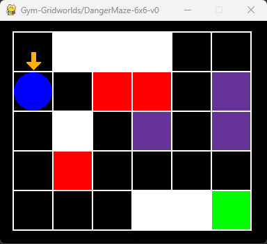
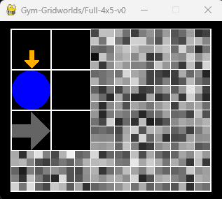
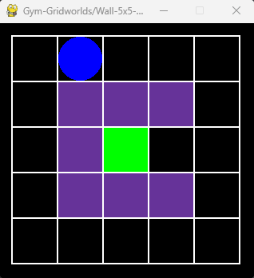

## Overview

Minimalistic implementation of gridworlds based on
[gymnasium](https://github.com/Farama-Foundation/Gymnasium), useful for quickly
testing and prototyping reinforcement learning algorithms (both tabular and with
function approximation).  
The default class `Gridworld` implements a "go-to goal" task where the agent has
five actions (left, right, up, down, stay) and default transition function
(e.g., doing "stay" in goal states ends the episode).  
You can change actions and transition function by implementing more classes.
For example, in `RiverSwim` there are only two actions and no terminal state.  


## Install and Examples

To install the environments run
```
pip install -e .
```

Run `python` and then

```python
import gymnasium
import gym_gridworlds
env = gymnasium.make("Gym-Gridworlds/Penalty-3x3-v0", render_mode="human")
env.reset()
env.step(1) # DOWN
env.step(4) # STAY
env.render()
```
to render the `Penalty-3x3-v0` gridworld (left figure),

```python
import gymnasium
import gym_gridworlds
env = gymnasium.make("Gym-Gridworlds/Full-4x5-v0", render_mode="human")
env.reset()
env.step(1) # DOWN
env.render()
```
to render the `Full-4x5-v0` gridworld (middle figure), and

```python
import gymnasium
import gym_gridworlds
env = gymnasium.make("Gym-Gridworlds/DangerMaze-6x6-v0", render_mode="human")
env.reset()
env.step(1) # DOWN
env.render()
```
to render the `DangerMaze-6x6-v0` gridworld (right figure).

<p align="center">
   &nbsp;&nbsp;&nbsp;&nbsp;&nbsp;
   &nbsp;&nbsp;&nbsp;&nbsp;&nbsp;
  
</p>

- Black tiles are empty,
- White tiles are pits (walking on them yields a large negative reward and the episode ends),
- Purple tiles are walls (the agent cannot step on them),
- Black tiles with gray arrows are tiles where the agent can move only in one direction (other actions will fail),
- Red tiles give negative rewards,
- Green tiles give positive rewards (the brighter, the higher),
- Yellow tiles are quicksands, where all actions will fail with 90% probability,
- The agent is the blue circle,
- The orange arrow denotes the agent's last action,
- The orange dot denotes that the agent did not try to move with its last action.

It is also possible to add noise to the transition and the reward functions.
For example, in the following environment
```python
import gymnasium
import gym_gridworlds
env = gymnasium.make("Gym-Gridworlds/Full-4x5-v0", random_action_prob=0.1, reward_noise_std=0.05)
```
the agent's action will fail with 10% probability and a random one will be performed instead,
and Gaussian noise with 0.05 standard deviation is added to the reward.

You can also turn the MDP into a POMDP and learn from partially-observable pixels
by passing the `view_radius` argument. This way, only the tiles close to the agent
will be visible while far away tiles will be masked by white noise. For example,
this is the partially-observable version of the `Full-4x5-v0` gridworld above.

```python
import gymnasium
import gym_gridworlds
env = gymnasium.make("Gym-Gridworlds/Full-4x5-v0", render_mode="human", view_radius=1)
env.reset()
env.step(1) # DOWN
env.render()
```

<p align="center">
  
</p>


## Make Your Own Gridworld

1. Define your grid in `gym_gridworlds/gridworld.py`, for example
```python
GRIDS["5x5_wall"] = [
    [EMPTY, EMPTY, EMPTY, EMPTY, EMPTY],
    [EMPTY, WALL, WALL, WALL, EMPTY],
    [EMPTY, WALL, GOOD, EMPTY, EMPTY],
    [EMPTY, WALL, WALL, WALL, EMPTY],
    [EMPTY, EMPTY, EMPTY, EMPTY, EMPTY],
]
```

2. Register the environment in `gym_gridworlds/gym.py`, for example
```python
register(
    id="Wall-5x5-v0",
    entry_point="gym_gridworlds.gridworld:GridworldRandomStart",
    max_episode_steps=50,
    kwargs={
        "grid": "5x5_wall",
    },
)
```

3. Try it
```python
import gymnasium
import gym_gridworlds
env = gymnasium.make("Gym-Gridworlds/Wall-5x5-v0", grid="5x5_wall", render_mode="human")
env.reset(seed=42)
env.render()
```

<p align="center">
  
</p>


## Default MDP (`Gridworld` Class)

#### <ins>Action Space</ins>
The action is discrete in the range `{0, 4}` for `{LEFT, DOWN, RIGHT, UP, STAY}`.

#### <ins>Observation Space</ins>
The observation is discrete in the range `{0, size - 1}`.
Each integer denotes the current location of the agent.
For example, in a 3x3 grid the states are

```
 0 1 2
 3 4 5
 6 7 8
```

If you prefer to observe the `(row, col)` index of the current position of the
agent, make the environment with the `coordinate_observation=True` argument.

To use classic RGB pixel observations, make the environment with the
`render_mode=rgb_array`.
Pixel observations can be made partial by passing `view_radius`. For example,
if `view_radius=1` the rendering will show the content of only the tiles
around the agent, while all other tiles will be filled with white noise.

Finally, you can also use binary observations by making the environment with
the `render_mode=binary` argument. Observations will be a matrix of 0s
and one 1 corresponding to the position of the agent.


#### <ins>Starting State</ins>
The episode starts with the agent at the top-left tile. Make new classes for
different starting states. For example, in `GridworldMiddleStart` the agent starts
in the middle of the grid, while in `GridworldRandomStart` it starts in a random tile.

#### <ins>Transition</ins>
By default, the transition is deterministic except in quicksand tiles,
where any action fails with 90% probability (the agent does not move).  
Transition can be made stochastic everywhere by passing `random_action_prob`.
This is the probability that the action will be random.
For example, if `random_action_prob=0.1` there is a 10% chance that the agent
will do a random action instead of doing the one passed to `self.step(action)`.  

#### <ins>Rewards</ins>
- Doing `STAY` at the goal: +1
- Doing `STAY` at a distracting goal: 0.1
- Any action in penalty tiles: -10
- Any action in small penalty tiles: -0.1
- Walking on a pit tile: -100
- Otherwise: 0

White noise can be added to all rewards by passing `reward_noise_std`,
or only to nonzero rewards with `nonzero_reward_noise_std`.

An auxiliary negative reward based on the Manhattan distance to the closest goal
can be added by passing `distance_reward=True`. The distance is scaled
according to the size of the grid.

#### <ins>Episode End</ins>
By default, an episode ends if any of the following happens:
- A positive reward is collected (termination),
- Walking on a pit tile (termination),
- The length of the episode is `max_episode_steps` (truncation).
