Unless stated otherwise, the agent must do `STAY` to get positive rewards in green tiles.  
Starting position is always the top-leftmost tile, unless the name of the environment has `RandomStart` or stated otherwise.

`Straight-1x20-v0`  
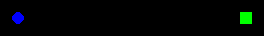

`Empty-RandomStart-2x2-v0`  
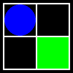

`Empty-RandomStart-3x3-v0`  
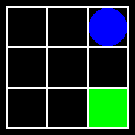

`Empty-RandomGoal-3x3-v0`Goal is randomized at every reset.  
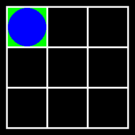

`Empty-Loop-3x3-v0`: One-directional tiles make a "loop-like" path in the top-right corner.  
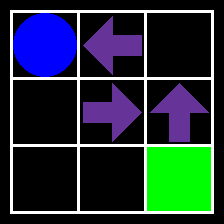

`Empty-10x10-v0`  

`Empty-Distract-6x6-v0`: Bottom-right goal is a "distractor".  
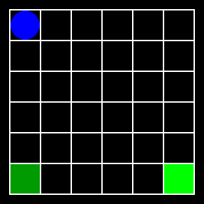

`Penalty-3x3-v0`: Red tiles with negative reward force the optimal agent to take a detour.  
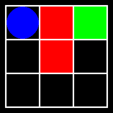

`Quicksand-4x4-v0`: Yellow tile is quicksand (the agent has only 10% chance of leaving it).  
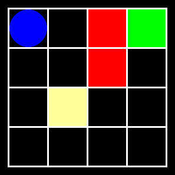

`Quicksand-Distract-4x4-v0`: Quicksand and two distractors.  
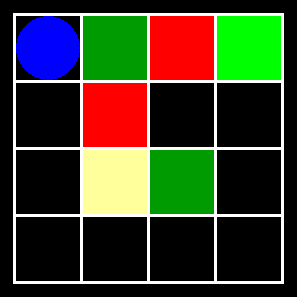

`TwoRoom-Quicksand-3x5-v0`: The one-directional tile and the quicksand split the grid into two rooms.  
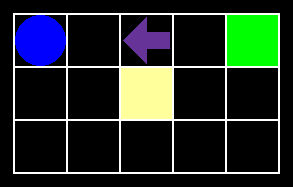

`Corridor-3x4-v0`: To get the highest reward, the agent must walk over small negative rewards.  
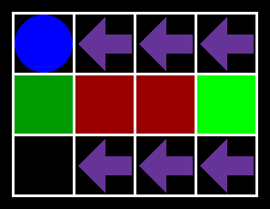

`Full-4x5-v0`: This grid has all the basic components: distractors, penalties, quicksand, and one-directional tiles.  
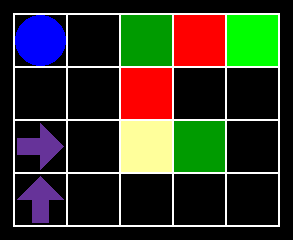

`Full-RandomGoalAndStart-4x5-v0`: Like above, but starting position and green tiles positions are randomized at every reset.  
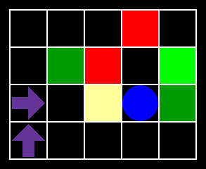

`TwoRoom-Distract-Middle-2x11-v0`: One-directional tiles split the grid into two rooms. The agent starts in the middle.  
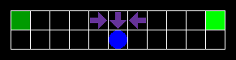

`Barrier-5x5-v0`: One-directional tiles make a barrier around the goal.  
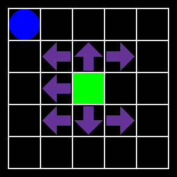

`RiverSwim-1x6-v0`: Classic RL benchmark. No need to `STAY` in green tiles.  
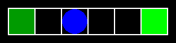

`CliffWalk-4x12-v0`: Classic RL benchmark.  
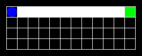

`DangerMaze-5x6-v0`: Maze-like grid with pits, walls, and negative rewards.  
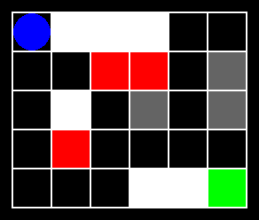

`FourRooms-Symmetrical-11x11-v0`: Classic RL benchmark. Start position and goal are randomized at every reset. No need to `STAY` in green tiles.  
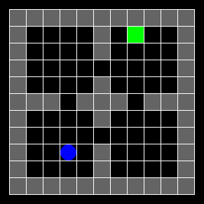

`FourRooms-Original-13x13-v0`: Classic RL benchmark. Start position and goal are randomized at every reset. No need to `STAY` in green tiles.  
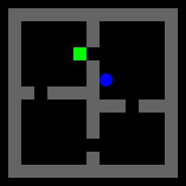

`FourRooms-Original-13x13-Stuck-v0`: The agent cannot exit the bottom-left room. Start position and goal are randomized at every reset. No need to `STAY` in green tiles.  
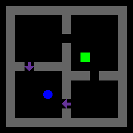

`FourRooms-Original-13x13-Loop-v0`: One-directional arrows enforce a "loop-like" path to visit all rooms. Start position and goal are randomized at every reset. No need to `STAY` in green tiles.  
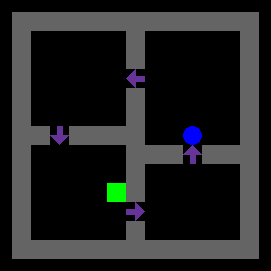

`FourRooms-Mini-8x7-v0`: Smaller version of the above environment.  
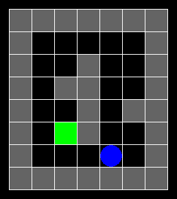

`FourRooms-Mini-8x7-Loop-v0`: Smaller version of the above environment.  
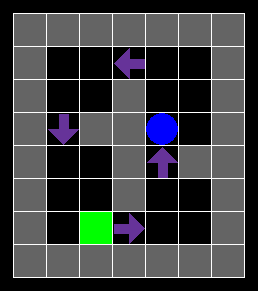

`FourRooms-Mini-8x7-Stuck-v0`: Smaller version of the above environment.  
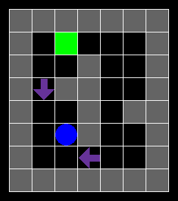

`FourRooms-Cross-14x16-v0`: Rooms are spread across the grid in a "cross-like" shape. Start position and goal are randomized at every reset.  
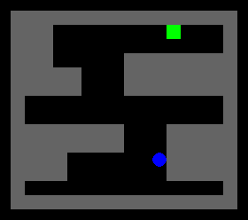

`Maze-12x12-v0`: [The agent starts in the middle. No need to `STAY` in green tiles.](https://arxiv.org/pdf/2505.01336).  
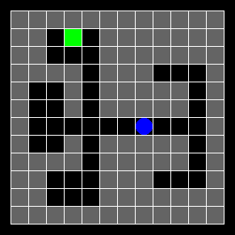

`CleanDirt-10x10-v0`: [Check full description here](gym_gridworlds/gym_gridworlds/clean_dirt.py)  
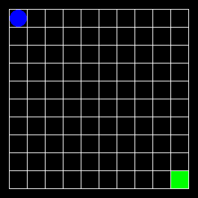

`TravelField-28x28-v0`: [Check full description here](gym_gridworlds/gym_gridworlds/travel_field.py). It has diagonal actions.  
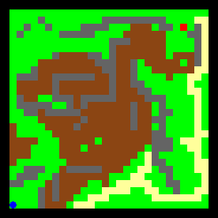

`TravelField-10x10-v0`: [Check full description here](gym_gridworlds/gym_gridworlds/travel_field.py). It has diagonal actions.  
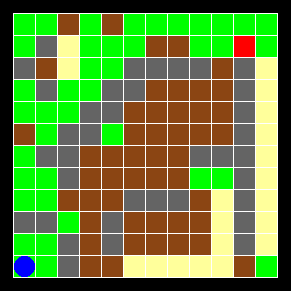

`TravelField-28x28-v1`: [Check full description here](gym_gridworlds/gym_gridworlds/travel_field.py). It has diagonal actions.  
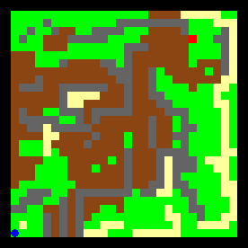

`TravelField-10x10-v1`: [Check full description here](gym_gridworlds/gym_gridworlds/travel_field.py). It has diagonal actions.  
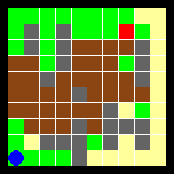

`Penalty-Randomized-4x4-v0`: The one-directional tile randomly changes at every step.  
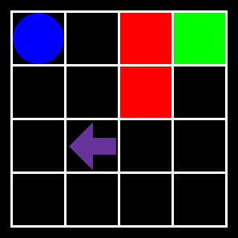

`Taxi-6x7-v0`: Classic RL benchmark. The agent starts in the top-rightmost tile. No need to `STAY` in green tiles.  
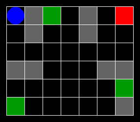

`Wall-50x50-v0`: Large grid with a wall dividing it into two areas. One distracting reward is in the top-rightmost tile, while the goal is at the bottom-rightmost tile. The agent always starts in the bottom-leftmost tile.  
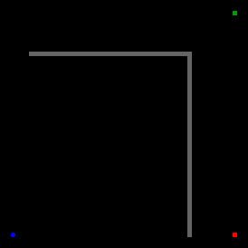
